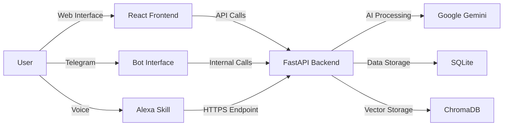

# MemoGenius 🧠✨ - Your AI-Powered Personal Assistant

## Overview

MemoGenius is an intelligent personal assistant that helps you manage reminders and access information through natural language conversations. The system combines a sleek React frontend with a powerful Python backend powered by Google Gemini AI, providing a seamless experience across web, Telegram interfaces, and Amazon Alexa devices.

## System Architecture 🏗️

MemoGenius consists of three main components:

- **Frontend Client**: A modern React application for web interactions
- **Backend Server**: A Python FastAPI service handling data persistence and AI processing
- **Voice Interface**: Amazon Alexa integration for voice-based interactions



## Features 🚀

- **Multi-Platform Access**: Use MemoGenius through Telegram, web interface, or Alexa devices
- **Smart Conversations**: Natural language processing with Google Gemini AI
- **Voice Interaction**: Speak with MemoGenius through Amazon Alexa
- **Reminder Management**: Create, edit, and get notifications for important events
- **Personal Memory**: Store and retrieve personal information with vector search
- **Real-time Information**: Search capabilities to answer questions from the web
- **Multilingual Support**: Interaction in both English and Italian
- **Synchronized Experience**: Consistent data across all platforms

## Recent Improvements 🛠️

- **Alexa Integration**: Full support for voice interaction through Amazon Alexa devices
- **Thread-safe Singleton Pattern**: Enhanced memory management with thread-safe initialization
- **Improved Function Handling**: Better management of multiple AI function calls
- **Internationalization**: Fully bilingual codebase with English and Italian support
- **Enhanced Vector Search**: More accurate memory retrieval with ChromaDB
- **Robust Error Handling**: Better user experience with graceful error recovery

## Getting Started 🏁

### Prerequisites

- Node.js 16+ and npm/yarn for frontend
- Python 3.8+ for backend
- Google Gemini API key
- Telegram Bot Token
- Amazon Developer Account (for Alexa integration)

### Installation

1. Clone the repository:
   ```bash
   git clone https://github.com/andrea9293/memogenius.git
   cd memogenius
   ```

2. Set up the backend:
   ```bash
   cd backend
   pip install -r requirements.txt
   # Create .env file with TELEGRAM_BOT_TOKEN and GEMINI_API_KEY
   ```

3. Set up the frontend:
   ```bash
   cd ../frontend
   npm install
   ```

### Running the Application

1. Start the backend server:
   ```bash
   cd backend
   python start_all.py
   ```

2. Start the frontend development server:
   ```bash
   cd frontend
   npm run dev
   ```

3. Access the web interface at http://localhost:5173

4. For Alexa integration, follow the detailed guide in [MEMOGENIUS_ALEXA_INTEGRATION_GUIDE.md](./backend/MEMOGENIUS_ALEXA_INTEGRATION_GUIDE.md).

## Project Structure 📁

- [`frontend/`](frontend/) - React frontend application
  - Components, contexts, hooks, and pages for web interface
  - [Detailed frontend documentation](frontend/README.md)

- [`backend/`](backend/) - Python FastAPI backend
  - AI processing, database models, and API endpoints
  - [Detailed backend documentation](backend/README.md)

## User Onboarding 🚪

### Web & Telegram
1. Start a chat with the MemoGenius Telegram bot
2. Use the `/key` command to get your web access key
3. Use this key to log in to the web interface

### Alexa
1. Set up the Alexa skill as detailed in the integration guide
2. Invoke with "Alexa, open memo genius"
3. Begin interacting with natural language commands
4. For best results, start requests with "memo genius" followed by your query

## Supported Interactions 🗣️

### Text Commands (Web & Telegram)
- "Remind me to call mom tomorrow at 6 PM"
- "Remember that my WiFi password is 12345"
- "What was my WiFi password again?"

### Voice Commands (Alexa)
- "Alexa, open memo genius"
- "memo genius what are my reminders"
- "neko remind me to buy milk tomorrow"
- "memo genius what time is it"

## Technologies Used 💻

### Frontend
- React 19 with TypeScript
- Material UI 6
- Vite for fast builds
- React Router for navigation

### Backend
- FastAPI for high-performance API
- SQLite for structured data persistence
- ChromaDB for vector storage
- Google Gemini API for AI capabilities
- Python Telegram Bot for Telegram integration

### Voice Interface
- Amazon Alexa Skills Kit
- Cloudflare Tunnels for secure HTTPS endpoints

## Contributing 🤝

Contributions are welcome! Please feel free to submit a Pull Request.

## License

This project is licensed under the [GNU Affero General Public License v3.0](LICENSE).

Copyright (c) 2025