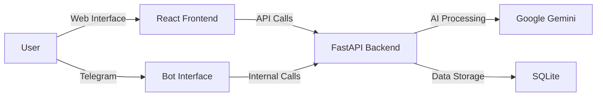

# MemoGenius 🧠✨ - Your AI-Powered Personal Assistant

## Overview

MemoGenius is an intelligent personal assistant that helps you manage reminders and access information through natural language conversations. The system combines a sleek React frontend with a powerful Python backend powered by Google Gemini AI, providing a seamless experience across both web and Telegram interfaces.

## System Architecture 🏗️

MemoGenius consists of two main components:

- **Frontend Client**: A modern React application for web interactions
- **Backend Server**: A Python FastAPI service handling data persistence and AI processing



## Features 🚀

- **Multi-Platform Access**: Use MemoGenius through Telegram or web interface
- **Smart Conversations**: Natural language processing with Google Gemini AI
- **Reminder Management**: Create, edit, and get notifications for important events
- **Real-time Information**: Search capabilities to answer questions
- **Synchronized Experience**: Consistent data across all platforms

## Getting Started 🏁

### Prerequisites

- Node.js 16+ and npm/yarn for frontend
- Python 3.8+ for backend
- Google Gemini API key
- Telegram Bot Token

### Installation

1. Clone the repository:
   ```bash
   git clone https://github.com/andrea9293/memogenius.git
   cd memogenius
   ```

2. Set up the backend:
   ```bash
   cd backend
   pip install -r requirements.txt
   # Create .env file with TELEGRAM_BOT_TOKEN and GEMINI_API_KEY
   ```

3. Set up the frontend:
   ```bash
   cd ../frontend
   npm install
   ```

### Running the Application

1. Start the backend server:
   ```bash
   cd backend
   python start_all.py
   ```

2. Start the frontend development server:
   ```bash
   cd frontend
   npm run dev
   ```

3. Access the web interface at http://localhost:5173

## Project Structure 📁

- [`frontend/`](frontend/) - React frontend application
  - Components, contexts, hooks, and pages for web interface
  - [Detailed frontend documentation](frontend/README.md)

- [`backend/`](backend/) - Python FastAPI backend
  - AI processing, database models, and API endpoints
  - [Detailed backend documentation](backend/README.md)

## User Onboarding 🚪

1. Start a chat with the MemoGenius Telegram bot
2. Use the `/key` command to get your web access key
3. Use this key to log in to the web interface

## Technologies Used 💻

### Frontend
- React 19 with TypeScript
- Material UI 6
- Vite for fast builds
- React Router for navigation

### Backend
- FastAPI for high-performance API
- SQLite for data persistence
- Google Gemini API for AI capabilities
- Python Telegram Bot for Telegram integration

## Contributing 🤝

Contributions are welcome! Please feel free to submit a Pull Request.

## License

This project is licensed under the [GNU Affero General Public License v3.0](LICENSE).

Copyright (c) 2025
